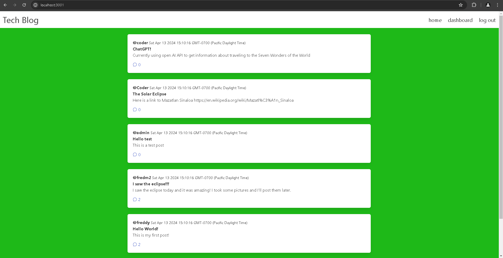

  <div align="center">
  <h1 align="center">tech blog</h1>
  <h3>Codebase for the tech blog platform</h3>
  <h3>◦ Developed with the software and tools below.</h3>
  <p align="center">


  </p>
  </div>
  
  ---
  ## 📚 Table of Contents
  - [📚 Table of Contents](#-table-of-contents)
  - [🔍 Overview](#-overview)
  - [🌟 Features](#-features)
  - [📁 Repository Structure](#-repository-structure)
  - [💻 Code Summary](#-code-summary)
  - [🚀 Getting Started](#-getting-started)
  
  ---
  
  
  ## 🔍 Description

 This is a Node.js project with a focus on building a blogging platform. The project includes a server, client-side rendering, and database integration. The server is built using Express.js and the client-side is built using Handlebars.js. The project also includes a database schema for storing user data, posts, and comments.

---

## 🌟 Features

 Node.js, Express.js, Handlebars.js, Blogging platform, User data, Posts, Comments, Database integration

---

## 📁 Repository Directory Structure

```bash
├── .env
├── .gitignore
├── controllers
│   ├── api-routes.js
│   ├── html-routes.js
│   └── index.js
├── db
│   └── schema.sql
├── LICENSE
├── models
│   ├── Comment.js
│   ├── index.js
│   ├── Post.js
│   └── User.js
├── package-lock.json
├── package.json
├── README.md
├── seeds
│   ├── commentData.json
│   ├── postData.json
│   ├── seed.js
│   └── userData.json
├── server.js
└── views
    ├── dashboard.handlebars
    ├── homepage.handlebars
    ├── layouts
    │   └── main.handlebars
    ├── login.handlebars
    ├── logout.handlebars
    ├── post.handlebars
    └── update-post.handlebars

```

---

## 💻 Code Summary

<details><summary>\controllers</summary>

| File | Summary |
| ---- | ------- |
| api-routes.js |  The code defines a router for an Express.js application that handles various HTTP requests and interacts with the Sequelize ORM to perform CRUD (create, read, update, delete) operations on models. |
| html-routes.js |  The code defines an Express.js router that handles requests for a social media platform, including rendering homepage, dashboard, individual post pages, and login/logout functionality. |
| index.js |  The code defines an Express.js router and imports two sets of routes, then uses them in the order they were imported, exporting the router for use in the application. |

</details>

---

<details><summary>\models</summary>

| File | Summary |
| ---- | ------- |
| Comment.js |  The code defines a Sequelize model for a Comment table, with columns for an ID, content, creator (a username), date created, and post ID (a foreign key referencing the ID of a related Post table). |
| index.js |  The code defines associations between three models (User, Post, and Comment) using Sequelize's ORM. Specifically, it establishes a one-to-many relationship between User and Post, with the foreign key being the username, and another one-to-many relationship between Post and Comment, with the foreign key being the post id. |
| Post.js |  The code defines a Post model in Sequelize, which represents a table in a database. The model has several columns, including an ID column, a title column, a content column, a creator column (which is a foreign key referencing the username of a user), and a date created column. The model also specifies that it should be connected to a database using the sequelize object from the connection.js file. |
| User.js |  The code defines a User model in Sequelize, which represents a user entity with an ID, username, and password. The model has a custom checkPassword method that uses bcrypt to compare the provided login password with the hashed password stored in the database. The model also has a beforeCreate hook that hashes the password before creating a new user. |

</details>

---

<details><summary>\seeds</summary>

| File | Summary |
| ---- | ------- |
| seed.js |  The code imports Sequelize, models, and data from JSON files, and then seeds the database with the data using the bulkCreate method. |

</details>

---

<details><summary>Root</summary>

| File | Summary |
| ---- | ------- |
| server.js |  The code initializes an Express.js server, sets up session and cookie management with Sequelize, and defines middleware for checking if a user is logged in or authenticated via a session store. |

</details>

---

## 🚀 Getting Started

 Getting Started with Tech Blog MVC<br>=====================================

This guide will help you get started with the Tech Blog MVC project. It covers the basic setup and configuration of the project, as well as some tips for getting started with the code.

1. Installing Dependencies
---------------------------

Before you can start working on the project, you need to install the necessary dependencies. To do this, run the following command in your terminal:
```
npm install
```
2. Setting up the Database
--------------------------

The Tech Blog MVC project uses a MySQL database to store user data, posts, and comments. You'll need to create a new database and update the `config/config.json` file with the appropriate credentials.

3. Running the Server
----------------------

To start the server, run the following command in your terminal:
```
npm start
```
4. Creating a New Post
-----------------------

To create a new post, navigate to the `/posts` route in your browser. You'll see a form where you can enter the title, content, and tags for your post. Once you've entered all the required fields, click the \Create\ button to submit the form.

5. Viewing Posts
-----------------

To view all the posts, navigate to the `/posts` route in your browser.

---
## Live Demo

Check out the live demo of the application here: [Travel Blog Live](https://tech-blog-mvc-express-8bd9dcae84c7.herokuapp.com/)

Vision of the Application: 

## Features

- **User Authentication**: Users can sign up for an account and log in to access personalized features.
- **Blog Posting**: Logged-in users can create, edit, and delete their own blog posts.
- **Comments**: Users can add comments to blog posts, fostering community interaction.
- **Responsive Design**: A clean and responsive user interface, adapting to various screen sizes and devices.

## Technologies Used

- **Node.js**: A JavaScript runtime built on Chrome's V8 JavaScript engine.
- **Express.js**: A web application framework for Node.js.
- **Sequelize**: A promise-based Node.js ORM for Postgres, MySQL, MariaDB, SQLite, and Microsoft SQL Server.
- **Handlebars.js**: A minimal templating engine.
- **MySQL**: Popular database.
- **dotenv**: Package to manage environment variables.
- **connect-session-sequelize**: Package that allows a session to persist using cookies.

## Installation

To run this application locally, you'll need Node.js and a MySQL database set up on your machine.

1. Clone the repository: ```git clone```

2. Install the dependencies: ```npm i```

3. Create a `.env` file in the root directory with the following contents:
```bash
DB_NAME='your_database_name'
DB_USER='your_username'
DB_PASSWORD='your_password'
```
4. Run the ```schema.sql``` in your MySQL database to create the necessary database.

5. Start the server: ```node server.js```

6. Visit ```http://localhost:3000``` in your local browser.

## Contributing

Contributions to the Tech Blog project are welcome!

1. Fork the repository.
2. Create a new branch for your feature (```git checkout -b feature/AmazingFeature```).
3. Commit your changes (```git commit -m 'Add some AmazingFeature'```).
4. Push to the branch (```git push origin feature/AmazingFeature```).
5. Open a pull request.


## License

This project is open source and available under the [MIT License](LICENSE).

---

© 2024 Tech Blog by [Fred Motta](https://github.com/fredm23579)
